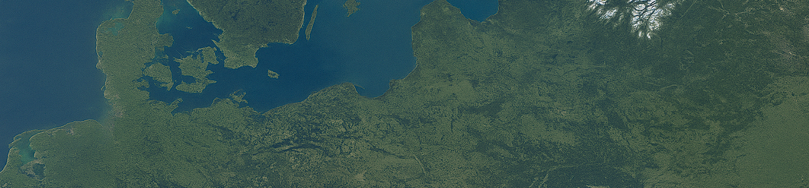

# 🧽 OpenAI to Z Challenge: Amazon Archaeology with AI

> 🗜️ A solo research project to detect hidden Amazonian archaeological sites using AI and remote sensing.

[](https://github.com/mctrinity/openai-to-z-challenge)

**Author:** Mary Ann Dizon
**Challenge:** [OpenAI to Z Challenge on Kaggle](https://www.kaggle.com/competitions/openai-to-z-challenge)

---

## 📢 Welcome to the OpenAI to Z Challenge!

This is a Hackathon with **no provided dataset**.
Please refer to:
👉 [kaggle.com/competitions/openai-to-z-challenge/data](https://www.kaggle.com/competitions/openai-to-z-challenge/data)
for open-source satellite, lidar, and historical data inspiration.

---

## 📁 Project Structure

```
openai-to-z-challenge/
├── data/                # Raw and processed geospatial data
│   ├── raw/
│   ├── processed/
│   └── docs/
├── notebooks/           # Exploratory notebooks (NDVI, lidar, GPT, etc.)
├── scripts/             # Python utilities (e.g., Earth Engine, processing)
├── visualizations/      # Maps, overlays, output images
│   ├── maps/
│   ├── overlays/
│   └── site_preds/
├── writeup/             # Final submission draft for Kaggle
├── requirements.txt     # Python dependencies
├── .env                 # GEE project ID and API keys (not tracked)
└── .gitignore           # Files excluded from version control
```

---

## 🚐 Tools & Technologies

* 🌍 [Google Earth Engine](https://earthengine.google.com/) for satellite data (Sentinel-2, SRTM, GEDI)
* 🧠 GPT-4.1 / OpenAI o3/o4 mini for geospatial document analysis
* 🗘️ `geemap`, `rasterio`, `geopandas` for visualization & processing
* 📚 Internet Archive, OpenTopography, academic papers

---

## 🚧 Current Focus

* ✅ Set up Earth Engine project & authentication
* ✅ Project folder structure + `.venv` + `.env`
* 🚐 Sentinel-2 NDVI analysis & export
* 🧠 GPT-assisted location extraction from historical text

---

## 📌 License

This repository is part of a Kaggle competition submission.
All code is released under **CC0 (public domain)** as required by the competition.

---

## 🛝 References

* [OpenAI to Z Challenge Overview](https://www.kaggle.com/competitions/openai-to-z-challenge)
* [Google Earth Engine Docs](https://developers.google.com/earth-engine)
* [OpenTopography](https://opentopography.org/)
* [Library of Congress Maps](https://www.loc.gov/maps/)
